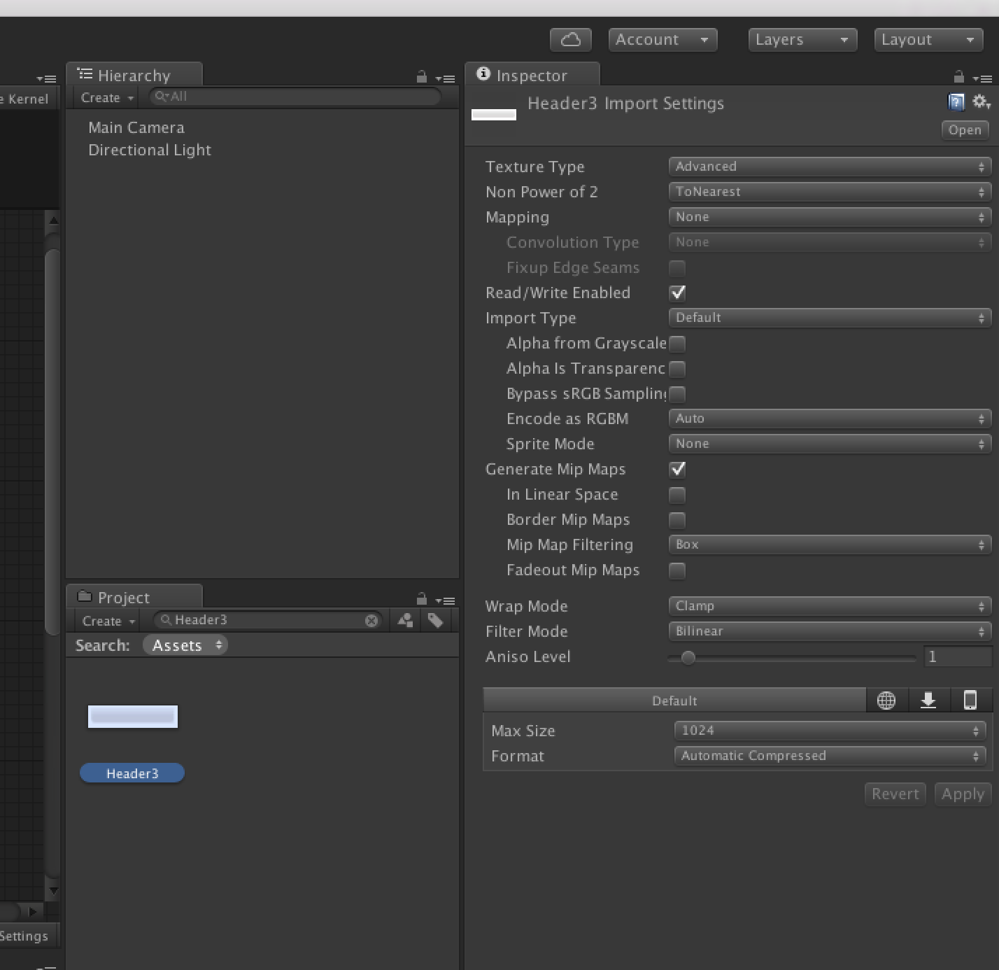

# CubeClicker
Unityエキスパート養成読本

第７章uFrame MVVMによるゲーム開発のサンプルです。

## 動作確認環境
OS:Mac OS X 10.10.4 Yosemite

Unity:5.3.1p1

uFrame:1.6.3r1

## CubeClickerサンプルの導入方法
　uFrame1.6.3r1がインポートされたプロジェクトに[CubeClicker.unitypackage](./CubeClicker.unitypackage)をインポートし、Build SettingsでCubeClickerのシーンをすべて追加してください。


## uFrame1.6.3r1のバグ対応

・コンパイルエラー対応

　UGUIBindings.cs 1行目に"|| UNITY_5_3"を追加する

```csharp
// UGUIBindings.cs
#if UNITY_4_6 || UNITY_5_0 || UNITY_5_1 || UNITY_5_2 || UNITY_5_3
using System;
using UniRx;
using UnityEngine;
using UnityEngine.Events;
using UnityEngine.EventSystems;
using uFrame.MVVM;
using uFrame.Kernel;
using UnityEngine.UI;

namespace uFrame.MVVM.Bindings
{
    public static class UGUIExtensions
    {
      ：
      ：
    }
}
#endif
```

・uFrame Designerを開くとエラーが発生する対応

　Header3画像の設定を変更、Texture TypeをAdvancedに変更、Read/Write Enebledにチェックを入れる


